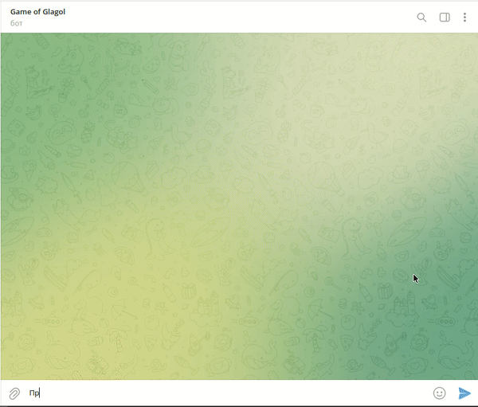
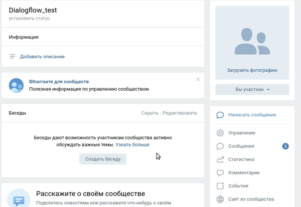

# Бот технической поддержки на основе dialogflow.

Реализованный при помощи [dialogflow](https://dialogflow.cloud.google.com/)(платформы для распознавания естественного языка) бот реализующий функции технической поддержки для крупного онлайн-издательства. При помощи обученной модели машинного обучение от dialogflow, бот распознает задаваемые ему вопросы, даже если они имеют не точно заданную формулировку. [Подробнее о принципах работы dialogflow](https://cloud.google.com/dialogflow/es/docs). Это помогает закрывать все типичные вопросы, не учитывая все возможные варианты как именно может быть задан вопрос. Если же вопрос не может быть распознан, то он перенаправляется на оператора.

На текущий момент имеется версия бота с интерфейсом во [вконтакте](https://vk.com/club213818971) и [telegram](https://t.me/glagol_game_bot). Для проверки работы бота во вконтакте, нажмите кнопку `Написать сообщение` в меню сообщества. Для проверки работы бота в telegram, перейдите по ссылке выше и запустите бота.

## Переменные окружения

Необходимые для корректной работы бота токены беруться из переменных окружения. Чтобы их определить, создайте файл `.env` в корневой папке проекта и запишите туда данные в таком формате: `ПЕРЕМЕННАЯ=значение`:

- `TELEGRAM_BOT_TOKEN` — токен вашего телеграм бота, с которым будет проходить общение. Создать нового телеграм бота и получить токен можно у [BotFather](https://telegram.me/BotFather).
- `VK_TOKEN` — токен вашего бота во вконтакте, с которым будет проходить общение. Чтобы создать нового бота во вконтакте и получить токен, [создайте новую группу вконтакте](https://vk.com/groups?tab=admin) и в разделе `Работа с API` настроек группы, создайте новый ключ. Добавьте полученный ключ как значение текущей переменной. Также разрешите боту отправлять сообщения от имени группы в подразделе `Настройки для бота`, раздела `Сообщения` в меню созданной группы.

- `GOOGLE_PROJECT_ID` — [идентификатор google проекта](https://cloud.google.com/resource-manager/docs/creating-managing-projects#identifying_projects), необходимый для работы dialogflow. Чтобы его получить, пройдите шаги описанные в [мануале по настройке dialogflow](https://cloud.google.com/dialogflow/es/docs/quick/setup).
- `GOOGLE_APPLICATION_CREDENTIALS` — выполнив [пункт настройки dialogflow](https://cloud.google.com/dialogflow/es/docs/quick/setup#sa-create) получите необходимый json файл и укажите в текущей переменной путь к этому файлу.

- `TELEGRAM_LOGGER_BOT_TOKEN` — токен вашего телеграм бота, в который будут приходить все логи работы ботов. Создать нового телеграм бота и получить токен можно у [BotFather](https://telegram.me/BotFather). После создания бота, запустите его, перейдя по сгенерированной ссылке и нажав кнопку `start`.
- `TELEGRAM_DEVELOPER_USER_ID` — id пользователя, кому бот будет присылать все логи работы ботов. Получить свой id можно у [этого телеграм бота](https://telegram.me/userinfobot).

## Как запустить

Перед началом выполните все шаги по [созданию агента dialogflow](https://cloud.google.com/dialogflow/docs/quick/build-agent). Далее переходите к инструкциям ниже:

- Для запуска сайта вам понадобится Python третьей версии.
- Скачайте репозиторий с кодом и прилегающими файлами.
- Установите зависимости командой `pip install -r requirements.txt`.
- Убедитесь что вы создали и наполнили файл `.env` по инструкции разделом выше.
- Чтобы подготовить ботов к работе и создать демонстрационную базу вопросов и ответов на основе dialogflow, выполните команду `python3 utils/dialogflow_helper.py`.
- Запустите бота в telegram командой `python3 telegram_bot.py`.
- Запустите бота во вконтакте командой `python3 vk_bot.py`.

## Как задеплоить бота на Heroku

- Скопируйте себе на github [репозиторий проекта](https://github.com/rimprog/support_bot).
- Зарегистрируйтесь и перейдите в раздел apps на сайте [Heroku](https://dashboard.heroku.com/apps).
- Нажмите кнопку `NEW`, а затем в выпадающем меню нажмите `Create new app`. Вы попадете на [страницу](https://dashboard.heroku.com/new-app) создания нового приложения.
- Заполните все необходимые данные и нажмите кнопку `Create app`.
- Через [графическое меню heroku](https://dashboard.heroku.com/apps/) откройте созданное приложение и в settings добавьте переменные окружения `.env` в `Config Vars`. [Подробнее о том](https://stackoverflow.com/questions/47446480/how-to-use-google-api-credentials-json-on-heroku), как добавить `credentials.json`.
- Откройте созданное приложение и перейдите в раздел `Deploy`.
- В подразделе `Deployment method` выберите свой скопированный `GitHub` репозиторий проекта и подключите его.
- Перейдите в подраздел `Manual deploy` и выбрав нужную ветку, нажмите кнопку `Deploy Branch`.
- Выше приложение готово к работе. Если приложение по какой-то причине не запустилось, проверьте [логи](https://devcenter.heroku.com/articles/logging#view-logs) вашего приложения и устраните указаннную ошибку.

## Цели проекта

Код написан в учебных целях — это урок в курсе по Python и веб-разработке на сайте [Devman](https://dvmn.org).
